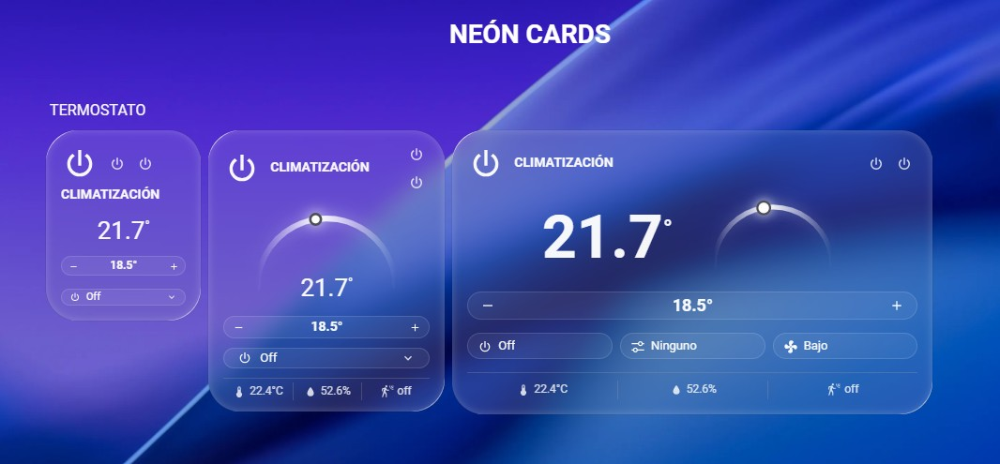
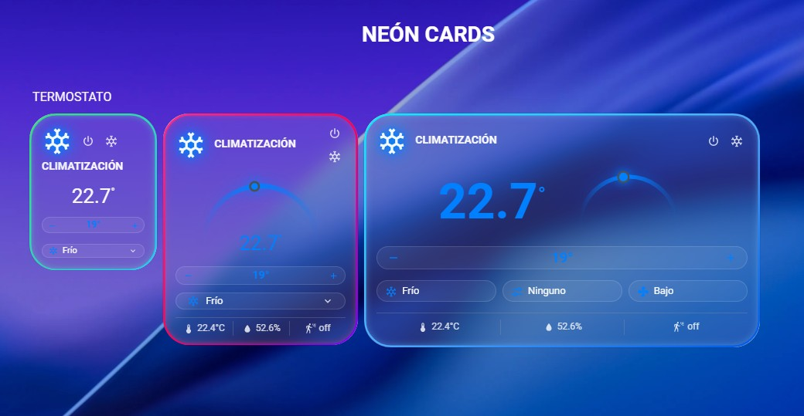

# examples/

🇪🇸 Español (esta sección) · 🇬🇧 [English below](#examples-english)

Ejemplos oficiales de uso de cada tarjeta y de cada API pública (acuerdo
nº12 y nº17).

## Neón Card Entity (`custom:neon-card-entity`)

### YAML mínimo

```yaml
type: custom:neon-card-entity
entity: light.living_room
```

### YAML avanzado

```yaml
type: custom:neon-card-entity
name: Salón
neon_palette: cyberpunk
entities:
  - entity: light.living_room
    name: Techo
  - entity: switch.tv_plug
    name: TV
tap_action:
  action: more-info
hold_action:
  action: toggle
double_tap_action:
  action: none
show_status_dot: false
primary_info: name
secondary_info: last-changed
card_orientation: right
```

### Capturas


### GIF


### Explicación

Neón Card Entity es un interruptor con un aro neón degradado de 3 colores
alrededor de la píldora. Cada entidad puede mostrar información primaria y
secundaria (nombre, estado, último cambio...), un punto de estado opcional,
y admite tap / mantener pulsado / doble toque configurables por separado.
La orientación de la tarjeta (`card_orientation`) permite elegir si la
píldora queda a la izquierda (por defecto) o a la derecha, con la
información en el lado contrario.

Ver la [referencia de API completa](../docs/es/api.md) para el detalle de
cada opción.

## Neón Button Card (`custom:neon-button-card`)

### YAML mínimo

```yaml
type: custom:neon-button-card
name: Salón
icon: mdi:sofa
```

### YAML avanzado

```yaml
type: custom:neon-button-card
entity: light.salon
subtitle: Luces
neon_palette: cyberpunk
tap_action:
  action: toggle
hold_action:
  action: more-info
double_tap_action:
  action: none
top_sensor:
  entity: sensor.salon_power
  icon: mdi:flash
  decimals: 0
sensors:
  - entity: sensor.salon_temperature
  - entity: sensor.salon_humidity
    icon: mdi:water-percent
```

### Capturas


### GIF


### Explicación

Neón Button Card es un botón de acción con entidad principal opcional:
puede navegar a otra pestaña, abrir un popup/more-info, ejecutar un
script/servicio, o representar una habitación/zona sin estar ligado a
ningún dominio concreto. En estado activo, un aro neón con degradado de
3 colores se dibuja en dos direcciones desde la esquina superior
izquierda, encontrándose en la inferior derecha — mismo lenguaje visual
que el aro de Neón Card Entity, pero con mecanismo propio (no comparte
componente con ella). Admite un sensor suelto (`top_sensor`) y hasta 3
sensores agrupados (`sensors`) bajo un divisor, con icono/estado/unidad
calculados automáticamente. El tamaño de la tarjeta (ancho y alto en el
grid de HA) se calcula solo según el contenido configurado.

## Neón Thermostat Card (`custom:neon-thermostat-card`)

### YAML mínimo

```yaml
type: custom:neon-thermostat-card
entity: climate.salon
```

### YAML avanzado

```yaml
type: custom:neon-thermostat-card
name: Salón
entity: climate.salon_calor
entity_2: climate.salon_frio
mode_owner:
  heat_cool: 1
size: large
color:
  mode: custom
  heat: "#ff4500"
  cool: "#0080ff"
neon_palette: cyberpunk
footer:
  - entity: sensor.salon_temperature
  - entity: sensor.salon_humidity
  - entity: binary_sensor.salon_presencia
    icon: mdi:motion-sensor
```

### Capturas




### GIF


### Explicación

Neón Thermostat Card controla una entidad `climate` con un dial/aro
semicircular (180°) arrastrable, coloreado según el modo HVAC activo.
A diferencia de Button, su tamaño no se calcula del contenido — se
elige con la clave `size` (`large`/`normal`/`compact`), cada uno con
su propio layout: el dial completo solo aparece en `large`,
`normal`/`compact` usan un indicador circular más pequeño, y
`compact` no muestra footer de sensores. Admite opcionalmente una
segunda entidad `climate` (`entity_2`) para representar dos equipos
separados (p. ej. calefacción + aire acondicionado) como uno solo — el
selector de modo muestra la unión de los modos de ambas entidades, y
las dos nunca quedan activas en modos distintos a la vez (la exclusión
mutua aplica da igual de dónde venga el cambio: la tarjeta, el diálogo
de la propia entidad, o una automatización), mientras que estar
activas juntas en el *mismo* modo sí está permitido. Igual que Button,
admite un footer de sensores (dominios `sensor`/`binary_sensor`,
máximo 3).


---

## Neón Sensor Card (`custom:neon-sensor-card`)

### YAML mínimo

```yaml
type: custom:neon-sensor-card
entity: sensor.temperatura_exterior
```

### YAML avanzado

```yaml
type: custom:neon-sensor-card
entity: sensor.temperatura_exterior
name: Temperatura Exterior
icon: mdi:thermometer
graph_hours: 24
neon_effect: halo
neon_palette: electric
thresholds_enabled: true
threshold_low: 22
threshold_high: 26
threshold_colors:
  low: "#4facfe"
  ok: "#39e07a"
  high: "#ff3d5a"
tap_action:
  action: more-info
```

Con un sensor binario:

```yaml
type: custom:neon-sensor-card
entity: binary_sensor.puerta_entrada
thresholds_enabled: true
alert_state: "on"
```

### Explicación

Neón Sensor Card muestra una única entidad `sensor` o `binary_sensor`
(cualquier otro dominio se rechaza): nombre, icono, valor con unidad y
estado y el histórico dibujado como el trazo de un monitor de
constantes vitales (el gráfico siempre está visible). `neon_effect`
elige el efecto: `halo` (por defecto, aro de tres colores y gráfico en
tres colores con desplazamiento), `single` (un solo color con
desplazamiento) o `normal` (color del tema, sin desplazamiento). Los
umbrales son opcionales: con `thresholds_enabled`, por debajo de
`threshold_low` es Bajo, por encima de `threshold_high` es Alto y entre
ambos es Correcto, cada nivel con su color (`threshold_colors`). El
tamaño (compacta, normal, grande) sale del ancho real de la tarjeta en
el grid; la compacta no muestra gráfico. No lleva pie de sensores.

---

<a id="examples-english"></a>

# examples/ (English)

🇬🇧 English (this section) · 🇪🇸 [Español arriba](#examples)

Official usage examples for every card and every public API (agreement
nº12 and nº17).

## Neón Card Entity (`custom:neon-card-entity`)

### Minimal YAML

```yaml
type: custom:neon-card-entity
entity: light.living_room
```

### Advanced YAML

```yaml
type: custom:neon-card-entity
name: Living Room
neon_palette: cyberpunk
entities:
  - entity: light.living_room
    name: Ceiling
  - entity: switch.tv_plug
    name: TV
tap_action:
  action: more-info
hold_action:
  action: toggle
double_tap_action:
  action: none
show_status_dot: false
primary_info: name
secondary_info: last-changed
card_orientation: right
```

### Screenshots


### GIF


### Explanation

Neón Card Entity is a switch with a 3-color neon gradient ring around the
pill. Each entity can show primary and secondary information (name,
state, last changed...), an optional status dot, and supports
separately-configurable tap / hold / double-tap actions. The card's
orientation (`card_orientation`) lets you choose whether the pill sits on
the left (default) or the right, with the information on the opposite
side.

See the [full API reference](../docs/en/api.md) for details on every
option.

## Neón Button Card (`custom:neon-button-card`)

### Minimal YAML

```yaml
type: custom:neon-button-card
name: Living Room
icon: mdi:sofa
```

### Advanced YAML

```yaml
type: custom:neon-button-card
entity: light.living_room
subtitle: Lights
neon_palette: cyberpunk
tap_action:
  action: toggle
hold_action:
  action: more-info
double_tap_action:
  action: none
top_sensor:
  entity: sensor.living_room_power
  icon: mdi:flash
  decimals: 0
sensors:
  - entity: sensor.living_room_temperature
  - entity: sensor.living_room_humidity
    icon: mdi:water-percent
```

### Screenshots


### GIF


### Explanation

Neón Button Card is an action button with an optional main entity: it
can navigate to another tab, open a popup/more-info, run a
script/service, or represent a room/zone without being tied to any
particular domain. In its active state, a 3-color neon gradient ring
draws itself in two directions from the top-left corner, meeting at the
bottom-right — the same visual language as the Neón Card Entity ring,
but with its own mechanism (no shared component between them). It
supports one ungrouped sensor (`top_sensor`) and up to 3 grouped sensors
(`sensors`) below a divider, with icon/state/unit computed
automatically. The card's size (width and height in HA's grid) is
computed automatically from its configured content.

## Neón Thermostat Card (`custom:neon-thermostat-card`)

### Minimal YAML

```yaml
type: custom:neon-thermostat-card
entity: climate.living_room
```

### Advanced YAML

```yaml
type: custom:neon-thermostat-card
name: Living Room
entity: climate.living_room_heat
entity_2: climate.living_room_cool
mode_owner:
  heat_cool: 1
size: large
color:
  mode: custom
  heat: "#ff4500"
  cool: "#0080ff"
neon_palette: cyberpunk
footer:
  - entity: sensor.living_room_temperature
  - entity: sensor.living_room_humidity
  - entity: binary_sensor.living_room_motion
    icon: mdi:motion-sensor
```

### Screenshots


### GIF


### Explanation

Neón Thermostat Card controls a `climate` entity with a draggable
semicircular (180°) dial/ring colored by the active HVAC mode. Unlike
Button, its size isn't computed from content — it's chosen with the
`size` key (`large`/`normal`/`compact`), each with its own layout: the
full dial only appears in `large`, `normal`/`compact` use a smaller
circular indicator, and `compact` shows no sensor footer. It optionally
supports a second `climate` entity (`entity_2`) to represent two
separate units (e.g. heating + AC) as one — the mode selector shows the
union of both entities' modes, and the two are never left active in
different modes at the same time (mutual exclusion applies no matter
where the change comes from: the card, the entity's own dialog, or an
automation), while being active in the *same* mode together is allowed.
Like Button, it supports a sensor footer (`sensor`/`binary_sensor`
domains, max 3).


---

## Neón Sensor Card (`custom:neon-sensor-card`)

### Minimal YAML

```yaml
type: custom:neon-sensor-card
entity: sensor.outdoor_temperature
```

### Advanced YAML

```yaml
type: custom:neon-sensor-card
entity: sensor.outdoor_temperature
name: Outdoor Temperature
icon: mdi:thermometer
graph_hours: 24
neon_effect: halo
neon_palette: electric
thresholds_enabled: true
threshold_low: 22
threshold_high: 26
threshold_colors:
  low: "#4facfe"
  ok: "#39e07a"
  high: "#ff3d5a"
tap_action:
  action: more-info
```

With a binary sensor:

```yaml
type: custom:neon-sensor-card
entity: binary_sensor.front_door
thresholds_enabled: true
alert_state: "on"
```

### Explanation

Neón Sensor Card shows a single `sensor` or `binary_sensor` entity (any
other domain is rejected): name, icon, value with unit and status
and the history drawn like the trace of a vital-signs monitor (the graph
is always visible). `neon_effect` picks the effect: `halo` (default,
three-color ring and a three-color graph with the sweep), `single` (one
color with the sweep) or `normal` (theme color, no sweep). Thresholds
are optional: with `thresholds_enabled`, below `threshold_low` is Low,
above `threshold_high` is High and in between is OK, each level with
its own color (`threshold_colors`). Size (compact, normal, large) comes
from the card's real width in the grid; compact shows no graph. It has
no sensor footer.
